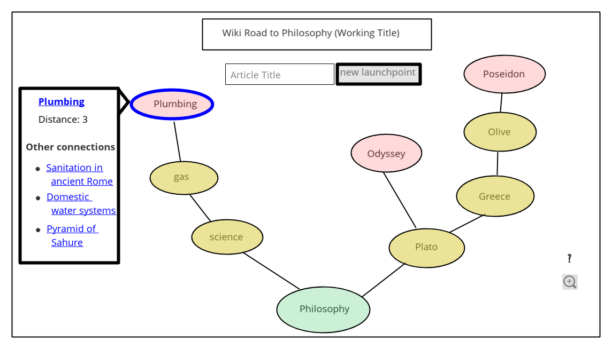

# The Hitchhiker's Guide To Philosophy

## Background
An unplanned feature of Wikipedia is how many of its articles can lead back to the <a href="https://en.wikipedia.org/wiki/Philosophy">Philosophy</a> page. This phenomenon has spawned a game for people to race to get to the Philosophy page from a random Wikipedia article. It has even become notable enough to have its own <a href="https://en.wikipedia.org/wiki/Wikipedia:Getting_to_Philosophy">article</a> on Wikipedia. _**<a href="https://andy-h-2016.github.io/hitchhikers-guide-to-philosophy/">The Hitchhiker's Guide to Philosophy</a>**_ visualizes the trail of articles that are traversed to get from any given article to the Philosophy page. The strategy employed is to traverse through the first link on each article, excluding links to pronounciation, etymology, and other Wikipedia boilerplate links.

## Functionality & MVP
Users will be able to:
* Enter an article title and see the list of articles that lead to the Philosphy article. This list will be represented as a chain of nodes.
   * Users will see new chains being constructed in real time, before they are added to the main chain.
   * Chains that use the same articles will show as converging.
   * Nodes will have links to the Wikipedia article it represents
* Adjust the visualization of the nodes. Available options will include zooming, panning, and moving the nodes.

In addition, there will be a modal introducing the app and how to use it. 

## Wireframe
The app will consist of a screen showing all of the nodes. Zoom controls will be available. Primary control scheme will be the mouse clicking and dragging to select nodes and move the view window around.

## Architecture & Technologies
The Wiki Road to Philosophy will be accomplished with the following technologies:
* `D3.js` for rendering of the nodes.
* `JavaScript` to handle user interaction via event listeners.
* `MediaWiki Action API` to access data on the links each Wikipedia article has.
* `Fetch API` will handle the AJAX requests to and responses from the `MediaWiki Action API`.

## Implementation Timeline
* Day 1: 
    * Create high-level proposal to map out goals and path to completion.
    * Get familiarized with `MediaWiki Action API` endpoints and their outputs.
    * Design `Javascript` functions to fetch the necessary data from the `MediaWiki Action API`.
* Day 2:
    * Design the `HTML/CSS` elements for the nodes, connections, and details dropdown
    * Implement logic via `Javascript` for creating a single chain of nodes to Philosophy
* Day 3:
    * Add functionality for chains with common nodes to converge.
    * Add functionality for controlling the viewport's zoom and location relative to the nodes.
* Day 4:
    * Create modal with introduction and instructions.
    * Polish styling.

## Bonus Features

* Optimization: Find the shortest path from one article to another.
* Allow user to input target destination instead of being constrained only to the Philosophy page.
* Add loading modal with animation to run while app is fetching data from `MediaWiki Action API` and rendering the HTML/CSS elements.
